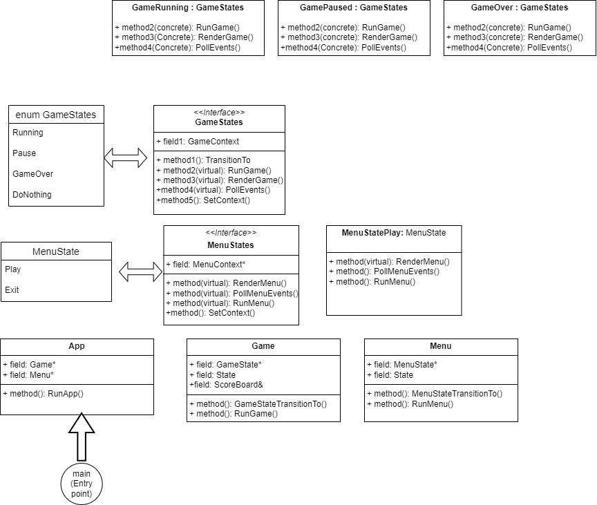

# sfml_games
A collection of games to be built using sfml library

## 1. Star ship
The game consists of a star ship/player that fires at the oncoming enemies. The enemies can be asteroids,
meteroids or rockets from alien space ship. The enemies appear randomly and each approach our star ship at different
speeds. The goal of the game is to shoot all the aproaching enemy targets and restrict them from crossing
or colliding with our ship. Points are earned in accordance to the speed of the enemy taken down i.e. taking down
a faster enemy earns more points. 

* **Controls:**  
	&#8592; move left  
	&#8594; move right  
	&#8679; shoot  
    *SPACE* pause

## 2. 2D shooter game
Player moves on a 2D map and the goal is to reach from the source to the destination. In between he/she encounters enemies
that needs to be shot. The enemies inturn can shoot the player and player has to dodge the enemy bullets and navigate safely to 
end. The game is implemented in state-design pattern for different game states: running, paused and gameOver. 
* **Controls:**  
	&#8592; move left  
	&#8594; move right  
	&#8679; shoot  
    *SPACE* jump 
	p pause

The UML class diagram is given below:

